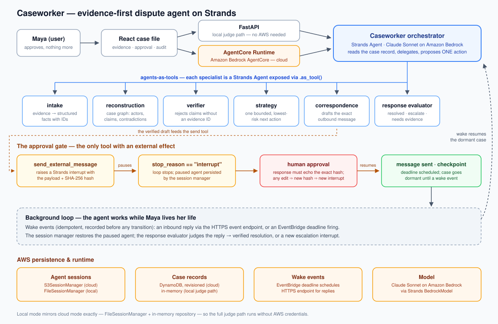

# Caseworker

**When every company says it is someone else's problem.**

Caseworker is an evidence-first agent for multi-party consumer disputes, built
on the **Strands Agents SDK** for the **Agents for Humans Hackathon**
(Everyday Agents track).

A package is marked delivered; the courier photo shows the wrong door. The
merchant sends you to the courier; the courier says only the merchant can
investigate. Caseworker takes ownership of that case: it reconstructs the
evidence, finds the contradictions, proposes one bounded action, pauses for
your approval, and keeps working in the background — waking on replies and
deadlines — until the dispute is verifiably resolved.



## How it uses Strands

- **Agents-as-tools**: a Caseworker orchestrator delegates to six specialists
  (intake, reconstruction, verifier, strategy, correspondence, response
  evaluator), each a Strands `Agent` exposed via `.as_tool()`.
- **Interrupts as the approval gate**: the only external-effect tool,
  `send_external_message`, raises a Strands interrupt carrying the exact
  payload and its canonical SHA-256 hash. The loop stops; a human answers; a
  hash mismatch blocks execution. No message leaves without approval.
- **Sessions as durable checkpoints**: `S3SessionManager` (cloud) /
  `FileSessionManager` (local) persist the agent across restarts, so a
  dormant case resumes exactly where it paused when a wake event arrives.
- **Amazon Bedrock** (Claude Sonnet) as the model, **AgentCore Runtime** as
  the deployment target.

Full design: [ARCHITECTURE.md](./ARCHITECTURE.md).

## Status

Agent topology, approval contract, session runtime, case repository
(in-memory + DynamoDB), idempotent wake events, and the HTTP API are in place
and tested (`uv run --extra dev pytest`). The React case file runs against the
API, and falls back to a deterministic local fixture when no backend is
reachable. The AgentCore entrypoint and deploy script are in place; the cloud
launch and the demo video land next.

## Run locally

```bash
cd backend
uv run --extra dev uvicorn app.api:api --reload --port 8000
```

```bash
cd frontend
npm install && npm run dev
```

The React case file talks to the API when it is reachable and falls back to a
deterministic local fixture when it is not, so the full demo path always runs.

## Deploy to Amazon Bedrock AgentCore

`backend/agentcore_app.py` wraps the same agent runtime in the AgentCore
contract (`POST /invocations` routed by `action`: `analyze`, `turn`,
`approve`, `get_case`, `reset_demo`). With AWS credentials and Docker/Finch
available:

```bash
./scripts/deploy_agentcore.sh us-east-1
```

For durable cloud state, set `CASEWORKER_REPOSITORY=dynamodb`,
`CASEWORKER_TABLE`, and `CASEWORKER_SESSIONS_BUCKET` on the runtime — case
records land in DynamoDB and paused agent sessions in S3, so an approval can
arrive days after the interrupt that requested it.

## Prior-work disclosure

The concept, React case-file UI, and demo fixture come from an earlier
unsubmitted prototype by the same author (built on a different agent
framework; never entered into any hackathon). The Strands implementation —
agent topology, interrupt-based approval, session persistence, and AWS
runtime — is new work for this hackathon. See ARCHITECTURE.md for the full
disclosure.

## License

MIT — see [LICENSE](./LICENSE).
